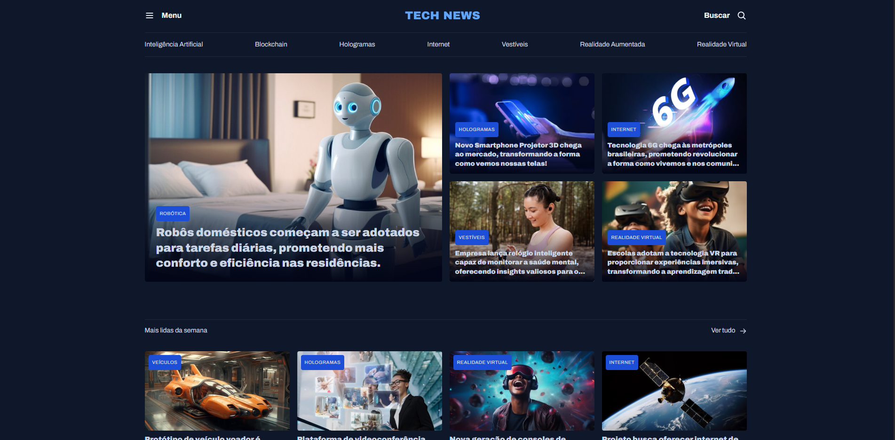

# 📰 Portal de Notícias - Rocketseat Challenge

Este projeto foi desenvolvido como parte de um desafio proposto no curso Fullstack da Rocketseat.  
A proposta foi criar uma página de notícias utilizando HTML e CSS, simulando a estrutura visual de um portal jornalístico moderno.

## 📚 Descrição do projeto

A página inclui:

- Título do portal e manchete principal
- Múltiplas seções de notícias
- Imagens ilustrativas
- Layout com organização visual clara e tipografia apropriada

## 💻 Tecnologias utilizadas

- HTML5  
- CSS3  
- Flexbox e Grid Layout  
- Tipografia e espaçamento moderno

## 🌐 Acesse o projeto online

🔗 [Clique aqui para ver o site publicado](https://kauasilvandrade.github.io/NewsPortal)

## 📸 Imagem do projeto

## 📌 Status do projeto

✅ Projeto finalizado e publicado.

## ✍️ Autor

**Kauã da Silva Andrade**  
[LinkedIn](https://www.linkedin.com/in/kauã-andrade-6440a9225)  
[GitHub](https://github.com/kauasilvandrade)
